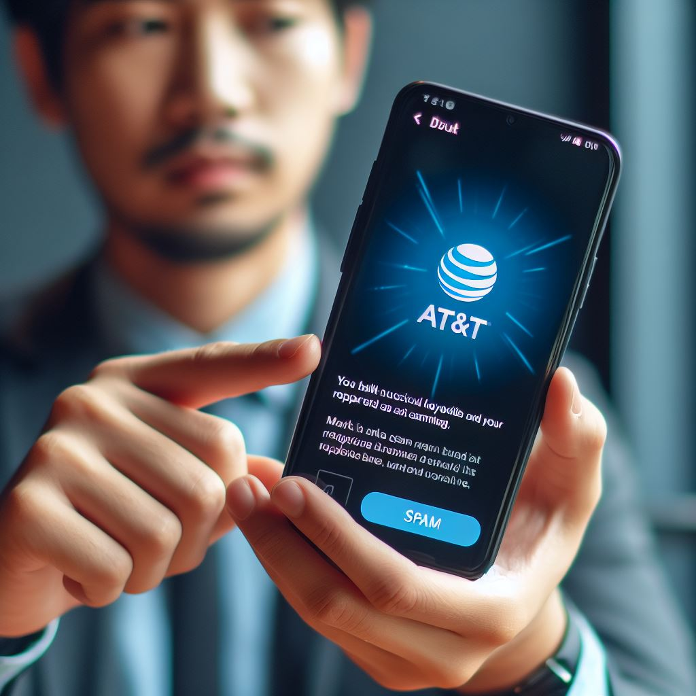

# AT&T Spam Detector Machine Learning

## Introduction

AT&T est la plus grande entreprise de télécommunications au monde en termes de revenus et le troisième plus grand fournisseur de services de téléphonie mobile aux États-Unis.

L'un des principaux problèmes auxquels sont confrontés les utilisateurs d'AT&T est l'exposition constante aux messages indésirables (spam).

AT&T a été en mesure de repérer manuellement les messages indésirables pendant un certain temps, mais ils cherchent maintenant une méthode automatisée pour détecter les spams afin de protéger leurs utilisateurs.

Mon objectif est de construire un détecteur de spams qui peut automatiquement repérer les spams au fur et à mesure qu'ils arrivent, basé uniquement sur le contenu des SMS.

## Clone du repo

Pour cloner le repo, utilisez la commande suivante :

`git clone https://github.com/Clementbroeders/spam-detector-ml.git`

## Comment ça marche ?

Pour réaliser cette étude, AT&T nous a fourni une liste de **5500 sms** déjà labellisés. Parmi ces sms, **13.4% sont des spams**.

Nous utilisons l'algorithme LSTM de deep learning pour déterminer le caractère spam ou non. Le LSTM est un type d'architecture de réseau de neurones récurrents (RNN) qui est particulièrement bien adapté pour traiter des séquences de données, comme des séquences de mots dans un texte.

# Etapes

Le notebook est entièrement automatisé et disponible à la racine du repo : `notebook.ipynb`

Une fois lancé, le modèle est créé, puis enregistré au chemin suivant : `src/model.h5`. Les métriques sont également enreigstrées au chemin suivant : `src/model_history.json`

Les résultats sont consutables dans le notebook, y compris que certaines visuels comme les matrices de confusion.